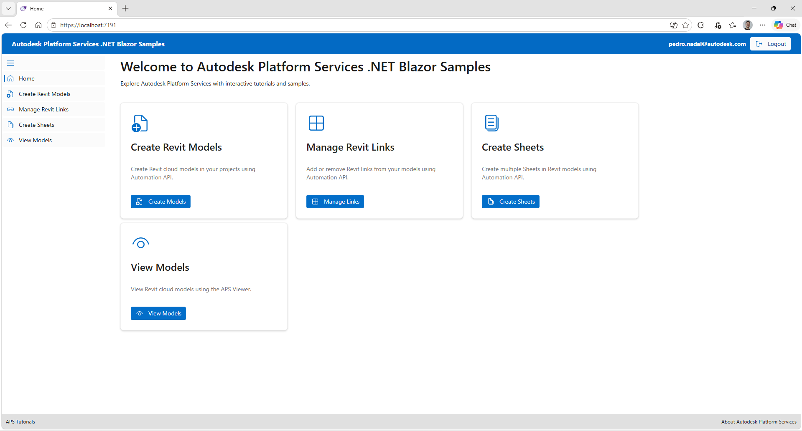

# Autodesk Platform Services .NET Blazor Samples


[](http://developer.autodesk.com/)
[](http://autodesk.com/revit)
[](https://dotnet.microsoft.com/)
[](https://docs.microsoft.com/en-us/dotnet/csharp/)
[](https://opensource.org/licenses/MIT)

---

A Blazor Server web application demonstrating how to use [Autodesk Platform Services (APS)](https://aps.autodesk.com/) with .NET 10. The sample showcases four key capabilities powered by the **APS Automation API**, **Data Management API**, and **Model Derivative API**:

- **Create Revit Models** – Programmatically create Revit cloud models inside Forma for Construction) projects.
- **Manage Revit Links** – Add or remove Revit links between models using a visual link matrix. Uses Autodesk Forma APIs to query linked-file relationships alongside the Automation API.
- **Create Sheets** – Batch-create sheets in Revit cloud models.
- **View Models** – Select a Revit cloud model and render it interactively in the browser using the APS Viewer with Blazor JavaScript Interoperability.

The app uses 3-legged OAuth to authenticate users via their Autodesk account, then lets them browse their hubs of Forma for Construction and projects through a folder explorer, configure automation jobs, and track their real-time status.



---

> **⚠️ Disclaimer**  
> This is a **vibe-coded sample solution** - an exploratory proof-of-concept developed iteratively. It demonstrates patterns and possibilities but may not follow all production-grade practices. This README was generated by **GitHub Copilot** based on analyzing the actual codebase, ensuring documentation matches implementation.

---

## Usage

1. Sign in with your Autodesk account via the **Sign In** button on the home page.
2. Choose one of the four workflows from the home page cards:
   - **Create Revit Models** – select a project and target folder, fill in the model configuration, and submit.
   - **Manage Revit Links** – select a project, build a link matrix between models, and apply it.
   - **Create Sheets** – select a project and Revit model, define the sheet list, and submit.
   - **View Models** – select a project, then select a .rvt model from the list to render it in the APS Viewer.
3. For the three automation workflows (Create Revit Models, Manage Revit Links, Create Sheets), track job progress on the corresponding tracking page; results are updated in real time. **View Models** is read-only and has no tracking page.

https://github.com/user-attachments/assets/8d185426-96b4-4d91-8dba-1b3a168ee8ce

---

## Development

### Prerequisites

- [Autodesk Platform Services app credentials](https://aps.autodesk.com/myapps/) (Client ID & Client Secret) with the following APIs enabled:
  - Data Management API
  - Forma for Construction API
  - Automation API
  - Model Derivative API
- A provisioned **Forma for Construction** account with at least one hub and project
- **Automation Activity** deployed for [APS Automation API Revit MCP Tools Sample](https://github.com/autodesk-platform-services/aps-automation-api-revit-mcp-tools-sample)
- [.NET 10 SDK](https://dotnet.microsoft.com/en-us/download/dotnet/10.0)
- A valid **Callback URL** registered on your APS app (e.g. `https://localhost:7000/api/auth/callback`)

---

### Steps to build and run the sample locally

1. **Clone the repository**

   ```bash
   git clone https://github.com/autodesk-platform-services/aps-dotnet-blazor-samples.git
   cd aps-dotnet-blazor-samples
   ```

2. **Configure app settings**

   Open `appsettings.json` (or use [.NET User Secrets](https://learn.microsoft.com/en-us/aspnet/core/security/app-secrets)) and fill in your credentials:

   ```json
   {
     "Forge": {
       "ClientId": "<your-client-id>",
       "ClientSecret": "<your-client-secret>",
       "CallbackUrl": "https://localhost:<port>/api/auth/callback",
       "RevitAutomationActivity": "<your-activity-alias>"
     }
   }
   ```

   Using User Secrets (recommended):

   ```bash
   dotnet user-secrets set "Forge:ClientId" "<your-client-id>"
   dotnet user-secrets set "Forge:ClientSecret" "<your-client-secret>"
   dotnet user-secrets set "Forge:CallbackUrl" "https://localhost:<port>/api/auth/callback"
   dotnet user-secrets set "Forge:RevitAutomationActivity" "<your-activity-alias>"
   ```

3. **Run the application**

   ```bash
   dotnet run
   ```

   Navigate to `https://localhost:<port>` in your browser.

---

### Deployment

When deploying to a hosting environment (e.g. Azure App Service):

- Set the four `Forge:*` values as environment variables or application settings.
- Ensure the **Callback URL** registered on your APS app matches the deployed URL.
- Automation API workitems use ngrok-style HTTP callbacks on the `/da` path — configure any reverse proxy to pass that path through without HTTPS redirection.
- The `GET /api/auth/viewer-token` endpoint is called from the browser by the APS Viewer and must be reachable over HTTPS on the deployed origin.

### Known limitations

- Job status is stored in-memory; restarting the application clears pending job history.
- The Automation API activity must already exist and be published before running the sample.

### Additional resources

- [Autodesk Platform Services documentation](https://aps.autodesk.com/developer/documentation)
- [Automation API](https://aps.autodesk.com/en/docs/design-automation/v3/developers_guide/overview/)
- [Data Management API](https://aps.autodesk.com/en/docs/data/v2/developers_guide/overview/)
- [Model Derivative API](https://aps.autodesk.com/en/docs/model-derivative/v2/developers_guide/overview/)
- [APS Viewer](https://aps.autodesk.com/en/docs/viewer/v7/developers_guide/overview/)

---

## License

This sample is licensed under the terms of the [MIT License](LICENSE). Please see the [LICENSE](LICENSE) file for full details.
